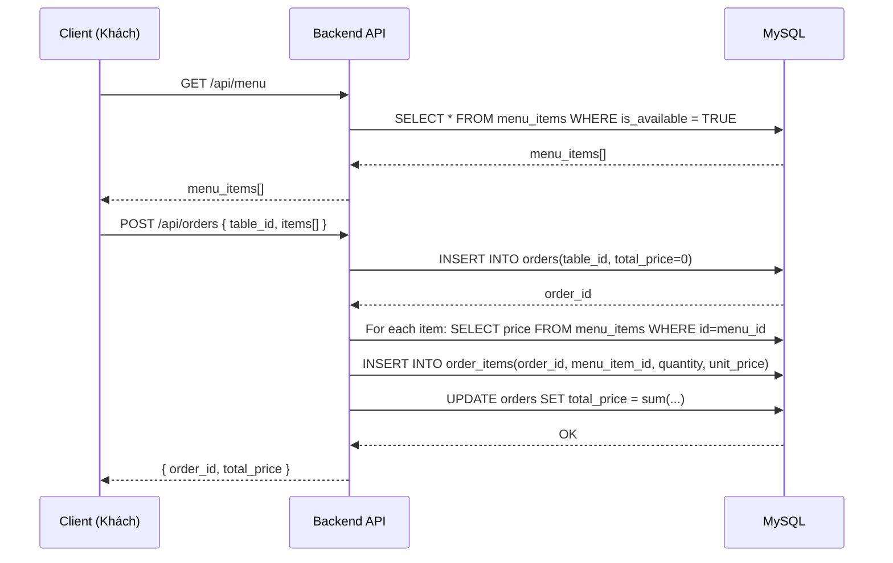
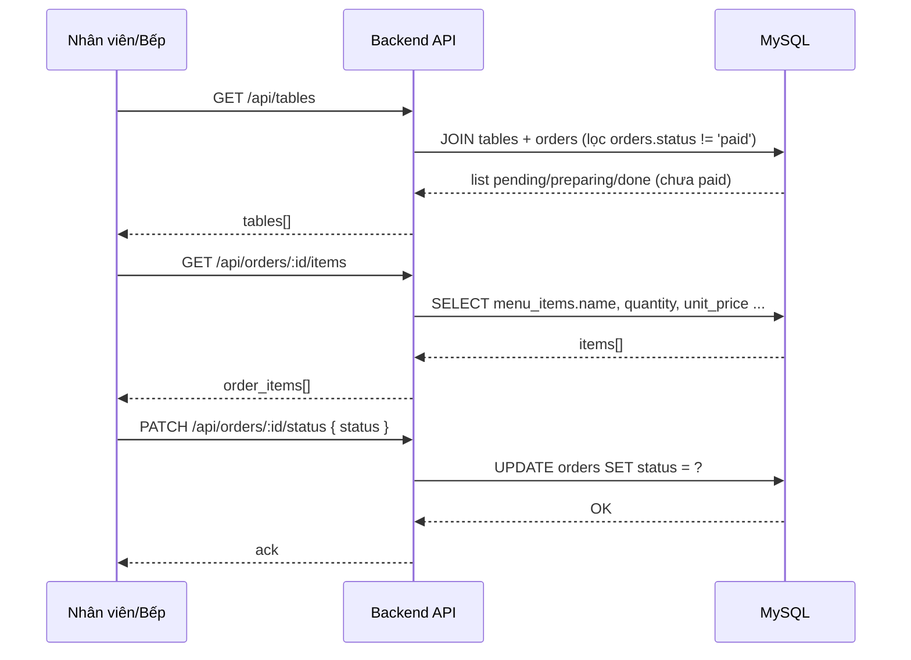

# Thiết kế hệ thống: Đặt món bằng QR

## 1. Tổng quan
Hệ thống cho phép khách hàng tại nhà hàng đặt món theo bàn bằng cách scan **QR** dẫn tới trang menu. Khách chọn món, thêm vào giỏ hàng và gửi đơn. Backend nhận đơn, tính tổng tiền và lưu vào MySQL.

Song song, hệ thống cung cấp API để nhân viên/bếp cập nhật trạng thái đơn (`pending -> preparing -> done -> paid`).

## 2. Thành phần hệ thống
- **Client (Web cho khách)**: React + Vite
  - Routing: trang chính là `/menu`
  - Lấy món theo bàn: đọc `table` từ query string (vd `/menu?table=5`)
  - API:
    - `GET /api/menu`
    - `POST /api/orders`
- **Server (Backend API)**: Express + MySQL
  - Cung cấp các endpoint menu/orders/tables/order-items
  - Tương tác DB qua `mysql2` connection pool
- **Database (MySQL)**:
  - `tables`: danh sách bàn
  - `menu_items`: danh sách món
  - `orders`: đơn hàng theo bàn + trạng thái
  - `order_items`: chi tiết món trong đơn

## 3. Kiến trúc mức cao
### 3.1 Luồng dữ liệu
- Khách mở trang menu
- Client gọi backend để lấy danh sách món có sẵn
- Khách tạo giỏ hàng trên client
- Khi đặt món, client gửi danh sách `{menu_id, quantity}` tới backend
- Backend:
  - tạo bản ghi trong `orders`
  - truy vấn giá món từ DB
  - tạo `order_items`
  - cập nhật `orders.total_price`
- Nhân viên/bếp có thể cập nhật trạng thái đơn qua API

## 4. Luồng hoạt động
### 4.1 Luồng khách đặt món

### 4.2 Luồng nhân viên cập nhật trạng thái

## 5. Thiết kế dữ liệu (DB Schema)
Từ `restaurant_qr_database.sql`, các bảng chính:
- `tables`
  - `id` (PK)
  - `table_number` (UNIQUE)
- `menu_items`
  - `id` (PK)
  - `name`
  - `price`
  - `image_url`
  - `is_available` (BOOLEAN)
- `orders`
  - `id` (PK)
  - `table_id` (FK -> `tables.id`)
  - `status` ENUM(`pending`,`preparing`,`done`,`paid`)
  - `total_price`
  - `created_at`
- `order_items`
  - `order_id` (FK -> `orders.id`)
  - `menu_item_id` (FK -> `menu_items.id`)
  - `quantity`
  - `unit_price` (lưu tại thời điểm tạo đơn)

## 6. Thiết kế API
Từ `backend/server.js` (và tài liệu `api.md`):

### Menu
- `GET /api/menu`
  - Lấy món `is_available = TRUE`

### Tạo đơn
- `POST /api/orders`
  - Request body:
    - `table_id: number`
    - `items: [{ menu_id: number, quantity: number }]`
  - Backend tự query `price` của từng món để tính `total_price`

### Tra cứu đơn/chi tiết
- `GET /api/orders`
  - Danh sách đơn kèm `table_number`, `status`, `total_price`, `created_at`
- `GET /api/orders/:id/items`
  - Danh sách món trong đơn: `name`, `quantity`, `unit_price`

### Cập nhật trạng thái
- `PATCH /api/orders/:id/status`
  - Request body: `{ status: "pending" | "preparing" | "done" | "paid" }`

### Bàn & đơn chưa paid
- `GET /api/tables`
  - LEFT JOIN `tables` với `orders` và lọc `orders.status != 'paid'`
  - Phục vụ việc hiển thị “bàn đang có đơn”

## 7. Quy tắc trạng thái đơn
- `pending`: đơn mới tạo (chờ bắt đầu)
- `preparing`: đang chuẩn bị/nấu
- `done`: sẵn sàng phục vụ
- `paid`: đã thanh toán (được xem là trạng thái kết thúc)

Gợi ý triển khai nghiệp vụ:
- Khi khách bấm đặt: server tạo đơn ở `pending`
- Khi bếp nhận đơn: chuyển sang `preparing`
- Khi xong món: chuyển sang `done`
- Khi khách thanh toán: chuyển sang `paid`

## 8. Giới hạn & giả định hiện tại
- Backend hiện **chưa có xác thực/phan quyen** cho nhân viên (ai gọi API cũng có thể patch status).
- Front-end hiện chỉ có trang menu cho khách (chưa có dashboard nhân viên trong `frontend/src`).
- `POST /api/orders` tính giá bằng cách select `price` từ `menu_items`, nên giá món sẽ phản ánh theo giá hiện tại trong DB.
- Endpoint QR generation (`/api/generate-qrs`) tồn tại nhưng có hard-code IP trong code.

## 9. Hướng mở rộng (nếu cần nâng cấp)
- Thêm auth cho nhân viên (JWT/session) và phân quyền theo vai trò.
- Tối ưu real-time bằng websocket hoặc polling cho dashboard nhân viên.
- Bổ sung pagination/sắp xếp theo trạng thái cụ thể cho `GET /api/orders`.
- Thêm các endpoint cho `cancel order`, `edit order` nếu nghiệp vụ cần.

